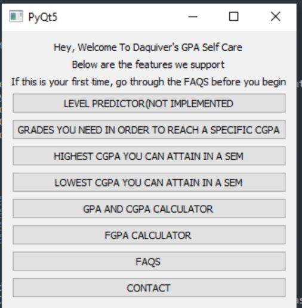
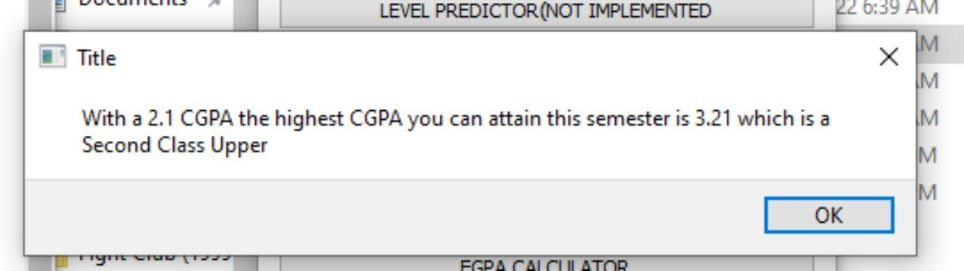
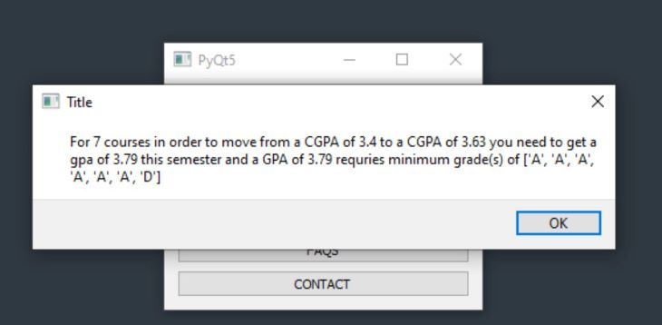

# GPA SELF CARE

A GPA self-care GUI I built for University of Ghana students. It's built with pyqt5. 
I built this because, there is a general lack of information regarding the GPA system in Legon. So this was built to provide students with information on how GPA/CGPA works.

## Getting Started

It supports the following features.
* Grades you need in order to boost your CGPA by a specified point.
* Highest CGPA you can attain in a semester.
* Lowest CGPA you can attain in a semester.
* GPA and CGPA Calculator.
* FGPA Calculator.
* FAQS.
* CONTACT.

## GUI Preview

## TODOS

- [ ] For GPA to Grades, modify it to factor weights(credit hours)
- [ ] Make it a webapp, so non-technical students can access it online. 

## Contribution
Your contriubtions and suggestions are heartily welcome!
You can clone, create a new branch then send a pull request. 